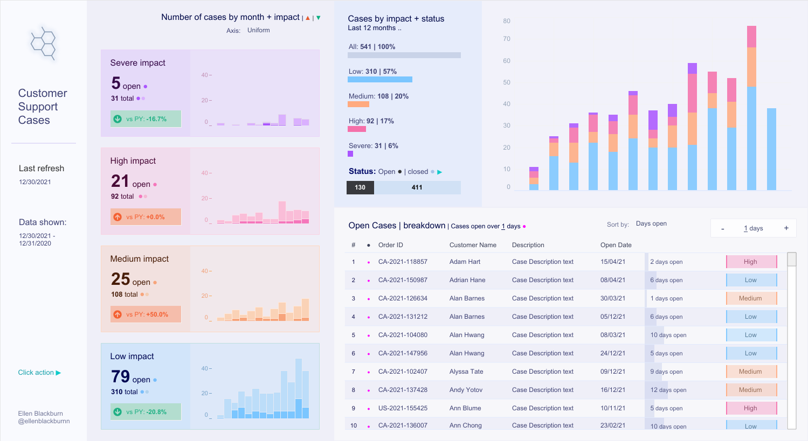
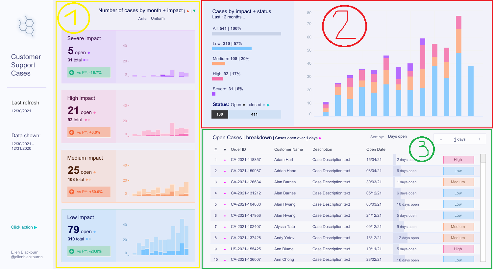
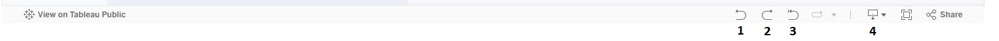
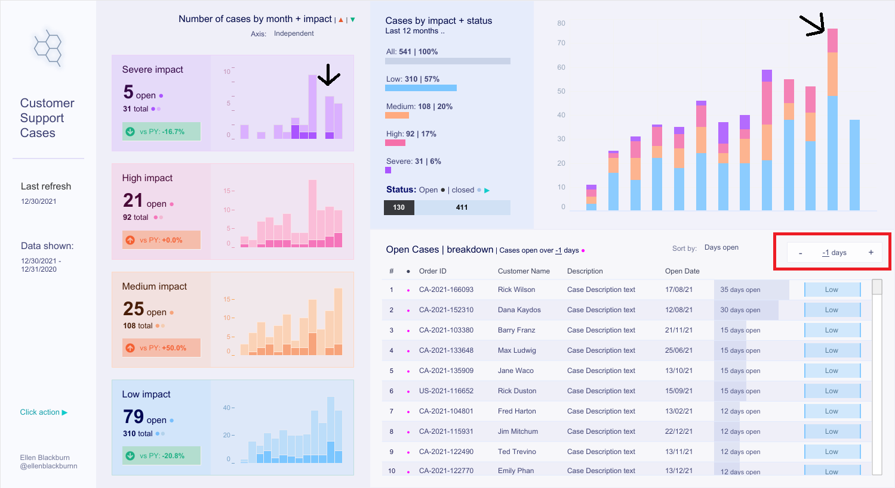

# Jetbrains-QA-Intern-in-Data-Analytics-Web-Application
List of the required number of manual test cases and bugs discovered during testing.

#### Fig. 1 Dashboard

The table is divided into three sections:
1. Number of cases by month + impact group of histograms denoted by the $${\color{yellow}yellow}$$ rectangle on the left
2. Cases by impact + status histogram separated with a $${\color{red}red}$$ border in the upper right
3. Open cases | breakdown table surrounded by a $${\color{green}green}$$ rectangle on the lower right
   

#### Fig. 2 Cases Numbered
In short - sections $${\color{yellow}1}$$, $${\color{red}2}$$ and $${\color{green}3}$$ color coded for convenience.

#Tests
## Tests

For tests 10-13:
#### Fig. 3 Buttons:

|No.| Test | Steps | Expected result | Actual result | Comments |
|---|---|---|---|---|---|
|1|Check if page loads|Clock or enter link "https://public.tableau.com/app/profile/ellen4268/viz/CustomerSupportCaseDemo/CustomerSupportCases" in browser search bar.|Page loads with all elements present.|Page loads with all elements present.|Passes. Smoke testing essentialy.|
|2|Are all appropirate fields full|Check every field, such as headers for missing data. |All data should be present.|Not all data is present.|Failed, the columns in the **Open cases** (**section 3**) aren't all named, not all cases are present in the **Cases by impact + status** histogram (**section 2**). |
|3|Window resize tolerance|Restore Down the browser window, then resize it. Check if all parts of the page can be accessed by scrolling and if every element loads. Finally, maximize the window again.|Every element loads and can be accessed by scrolling.|Every element loads and can be accessed by scrolling.| Passed, everything works after restoring the window. |
|4|Test Sort by|In **section 3** table **Open cases** press the **Sort by** dropdown menu -> select **Days open** -> observe results. |Cases sorted by the stated number of days that they've been unresolved.|Cases sorted by the stated number of days that they've been unresolved.| Passes.|
|5|Test Sort by|In **section 3** table **Open cases** press the **Sort by** dropdown menu -> select **Impact** -> observe results. |Cases sorted by their impact (severity).|Cases sorted by their impact (severity).| Passes.|
|6|Test sorting columns|In **section 3** table **Open cases** click on **Open Date** column header -> observe results.|Table entries sorted by date|Table entries sorted by date.| Passes.|
|7|Test sorting columns + Sort By|In **section 3** table **Open cases** press the **Sort by** dropdown menu -> select **Impact** -> Click on **Customer Name** column header.|Cases grouped by impact, then sorted by Customer Name.|Cases grouped by impact, then sorted by Customer Name.| Passes. |
|8|Test sort by days number selector|In **section 3** table **Open cases** press either the **+** or **-** button in the numbers field next to the **Sort by** dropdown menu|The number of days unresolved changes, as well as the marked entries in the table.|The number of days unresolved changes, as well as the marked entries in the table.| Passes.|
|9|Test Sort by|In **section 3** table **Open cases** press the **Sort by** dropdown menu -> select **Days open** -> press the **-** button in the numbers field next to the **Sort by** dropdown menu untill the number is <0 .|Error message, fail|Every entry in table is marked, cases sorted by the stated number of days that they've been unresolved.| Passes, impossible values shouldn't be allowed. |
|10|Test Undo action|In the lower right of the dashboard hover over first button in the group, **fig. 3 button 1** -> tooltip should show "Undo my last action"-> click the button.|The last action is reversed.| The last action is reversed.| Passes.|
|11|Test Redo action|In the lower right of the dashboard hover over the button to the right of the Undo button, **fig. 3 button 2** -> tooltip should show "Redo my last action"-> click the button.|The last action is redone.| The last action is redone| Passes.|
|12|Test Reset View|In the lower right of the dashboard hover over the button to the right of the Redo button, **fig. 3 button 3** -> tooltip should show "Reset View"-> click the button.|All settings have been reset.| All settings have been reset.| Passes.|
|13|Test downloading data|Click button like in **fig. 3 button 4** -> Press Choose format to download key->image.|Image downloaded.|Image downloaded.|Passes.|
|14|Testing connections between sections|Click on one of the monthly reports of **section 1**-> observe results in **sections 2** and **3**.|Monthly section is selected in both **sections 2** and **3**.|Nothing happens.| Fails. Selecting a month in **section 1** does nothing.|
|15|Test for data discrepancy|Compare the total numbers in both **section 1** and **section 2**, are both the individual entries and the sum equal.|All numbers are equal.|All numbers are equal.|Passes.|
|16|Test for data discrepancy 2|Compare the monthly histogram values in both **section 1** and **section 2**, are they equal.|All parts are equal|There are values missing in **section 2**.|Fails.||||||
|17|Check if status open/closed is working|In **section 2**, the **Cases by impact + status** histogram click on either of the rectangles on the left side bellow the **Status: Open\|Closed** label. Press again to revert choice. |The histogram and numbers should change to reflect the choice.|The histogram and numbers did change to reflect the choice. |Passes.|
|18|Check by type of impact|In **section 2**, the **Cases by impact + status** histogram click on any of the individual type of impact, for exanoke **Medium**.|The histogram should change to diplay only the chosen type.|The histogram changes accordingly.|Passes.|
|19|Testing connections between **sections 2** and **3**| Like in the previous case (18) choose a type of impact and see if the table changes to reflect the choice |Table displays just the cases with the chosen type of impact.|Table changes as expected.|Passes.|
|20|Testing connections between **sections 2** and **3** the sequel|In **section 2**, the **Cases by impact + status** histogram click on any of the individual rectangle representing a month and an impact type|The **Open cases** table should isolate just the chosen impact type cases submitted in the appropriate time period|The table does not change.| Fails.|

## Bugs and glitches

##### Fig. 4:

|No.|Text|Comment|
|---|---|---|
|1|In **section 3** table **Open cases** pressing either the **-** in the numbers field next to the **Sort by** dropdown menu allows changing the **Cases opened over _ days** to be negative, for example "Cases opened over -3 days"|See fig. 4|
|2|The main histogram in **section 2** does not present all cases and shows wrong numbers. Case in point severe impact cases (0) and high impact (shows 4 instead of 3)in Nov. 2021 |See fig. 4|
|3|Not much of a bug so much as a discrepancy between the sections. In the **Cases by impact + status** histogram (**section 2**) Impact of the cases isordered in reverse compared to the other parts. For uniformity's sake. ||
|4|In **section 3** table **Open cases** table the case type column (·) should be renamed for more legibility.||
|5|In **section 3** table **Open cases** table the days opened column header should not be blank.||
|6|In **section 3** table **Open cases** table the case impact column header should not be blank.||
|7|When toggling closed cases in **section 2** and selecting a single type of impact, the same type is isolated in **section 3** table **Open cases**, under those conditions it shouldn't.
|8|The **Open cases** table doesn't reflect the highlighted and chosen part of the **Cases by impact + status** histogram as per test 20. 

